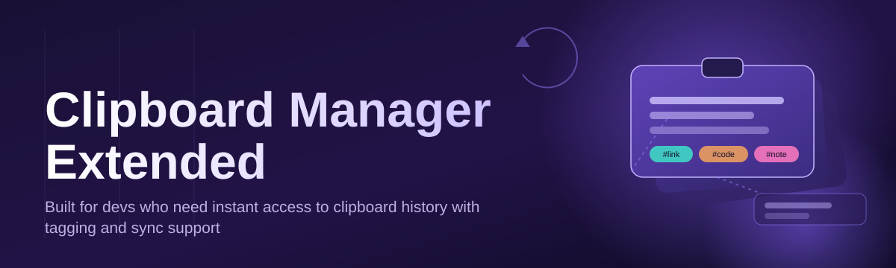
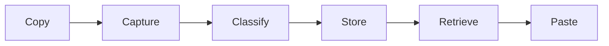

# clipboard-manager-suite 📋⚡

  

*Your clipboard has a memory problem. This fixes it.*

---

## 🧠 What This Actually Is

**What this is NOT:** a browser extension, a cloud subscription service, a bloated Electron shell chewing 400MB of RAM to remember six lines of text. It's not a "sync everything to our servers" data grab either.

**What it is:** a native Windows utility that turns your clipboard from a one-slot, blink-and-it's-gone buffer into a searchable, persistent, multi-format history engine. Copy fifty things in a row — every single one stays retrievable. Text, rich formatting, images, file paths, color swatches — all indexed, all instant, all local.

Clipboard Manager Extended exists because Ctrl+C / Ctrl+V was designed in an era when you copied one thing at a time. Developers juggling snippets, writers pulling quotes across documents, designers grabbing hex codes and assets, support agents pasting the same canned replies fifty times a day — none of that workflow fits in a single-slot buffer. This is the missing layer between your keyboard and your apps, built for people who copy-paste for a living and refuse to lose data to a careless Ctrl+C.

> [!NOTE]
> Everything runs locally. No account, no telemetry ping, no clipboard content ever leaves your machine unless you explicitly export it.

  

---

## 🔥 What It Actually Does

- **Infinite scrollback, finite footprint** — history depth is configurable (100 / 500 / 2000 / unlimited entries), pruned intelligently so old junk doesn't choke performance.

- **Format-aware capture** — plain text, rich text, images, HTML fragments, and file-path lists are each stored with their native structure intact. Paste a table, get a table back — not a wall of tab characters.

- **Instant fuzzy search** — hit a shortcut, start typing, results filter live. No scrolling through hundreds of entries hunting for "that one URL from Tuesday."

- **Pinned & favorited snippets** — signatures, boilerplate replies, license headers, frequently-used code blocks — pin them so they never scroll out of reach.

- **Multi-clipboard slots** — assign dedicated hotkey slots (like a hotbar) for things you paste constantly: an email signature, a support macro, a recurring code snippet.

- **Smart de-duplication** — copy the same string twice, it doesn't clutter your history with duplicates — it just bumps the timestamp.

- **Sensitive-content shielding** — detected password-manager copies and card-number patterns auto-expire from history after a configurable window, instead of sitting there indefinitely.

- **Cross-app paste targeting** — paste history retains awareness of formatting quirks across apps (plain-text-only fields get auto-stripped rich text, for instance).

- **Portable mode** — run the whole suite off a USB stick with zero registry footprint, if that's your thing.

---

## 🚀 Up and Running

1. Visit the landing page via the download button above.

2. Grab the latest build — no installer wizard, no bundled toolbars, no "recommended" third-party software.

3. Run the executable. Windows SmartScreen may flag an unsigned binary on first launch — click "More info → Run anyway."

4. The tray icon appears. Copy something. Press the history shortcut. You're already using it.

> [!TIP]
> Pin the tray icon to your taskbar corner so it's always one click away from Settings.

---

## 🖥️ System Requirements

| Component | Minimum |
|---|---|
| OS | Windows 10 (64-bit) or Windows 11 |
| RAM | 150 MB idle footprint |
| Disk | ~40 MB installed |
| Dependencies | None — fully standalone binary |
| .NET / Runtime | Bundled, nothing to install separately |
| Admin rights | Not required for standard install |

  

---

## ⚙️ How It Works

The suite runs a lightweight background listener that hooks the Windows clipboard event chain — every copy operation gets intercepted, fingerprinted, and stored before your next keystroke even lands.

1. **Capture** — a system hook detects a new clipboard write.

2. **Classify** — content type is inspected (text / rich / image / files) and normalized.

3. **Store** — entry is written to a local encrypted-at-rest index, deduplicated against recent history.

4. **Retrieve** — hotkey opens the history panel; fuzzy search narrows results instantly.

5. **Paste** — selected entry is reinjected into the clipboard and delivered to the active app.

> [!IMPORTANT]
> The listener is passive — it never modifies clipboard content on the way in, only on the way back out when you actively select something to paste.

---

## 🧩 Interface & Interaction

**Default shortcuts:**

| Action | Shortcut |
|---|---|
| Open history panel | `Ctrl` + `Shift` + `V` |
| Quick-search history | `Ctrl` + `Shift` + `F` |
| Pin current entry | `Ctrl` + `Shift` + `P` |
| Clear history | `Ctrl` + `Shift` + `Del` |
| Paste as plain text | `Ctrl` + `Shift` + `Alt` + `V` |
| Cycle clipboard slots | `Alt` + `1` through `9` |

<strong>Themes and appearance options</strong>

- Dark, Light, and "Midnight Amber" high-contrast theme
- Compact vs. Comfortable list density
- Optional thumbnail previews for image entries
- Adjustable panel position — cursor-anchored or fixed-corner

<strong>Settings worth knowing about</strong>

- History retention window (time-based or count-based)
- Auto-launch on Windows startup toggle
- Exclusion list — block specific apps from being tracked (banking apps, password managers)
- Export history to plain-text or JSON archive
- Global hotkey remapping for every action above

> [!WARNING]
> Disabling the exclusion list for password managers means their clipboard output *will* be indexed. Leave it on unless you know exactly what you're doing.

---

## 🩹 Troubleshooting

**Q: The tray icon vanished but the process is still running — what gives?**
A: Windows sometimes hides tray icons under the overflow arrow. Check there first before assuming it crashed.

**Q: My clipboard history is empty after a restart.**
A: Portable mode doesn't persist history across sessions by design. Switch to standard install mode in Settings if you want persistence.

**Q: Pasting into a specific app strips my formatting.**
A: Some apps only accept plain text on paste — that's the target app's behavior, not this tool's. Use "Paste as plain text" to match intentionally instead of fighting it.

**Q: The hotkey doesn't open the panel anymore.**
A: Another application likely claimed that key combination. Remap it in Settings → Shortcuts.

**Q: Images aren't showing thumbnails in history.**
A: Thumbnail generation is opt-in for performance reasons on older hardware — enable it under Appearance settings.

**Q: Is my clipboard data sent anywhere?**
A: No. Everything is stored locally. There is no cloud sync component in this build.

---

## 🌱 Contributing & Community

Bug reports, feature requests, and pull requests are genuinely welcome — this project grows because people who live in their clipboard history every day tell us what's missing.

- Open an issue with reproduction steps for bugs
- Propose features with a real workflow example, not just "it'd be cool if"
- PRs should target a single change — smaller diffs get reviewed faster
- Discussions tab is open for general workflow tips and theme-sharing

> [!TIP]
> Found a rough edge in the search algorithm? That's one of the most actively refined parts of the codebase — issues there tend to get fast attention.

---

## 📄 License

Released under the [MIT License](LICENSE), 2026.

---

## ⚠️ Disclaimer

This software is provided "as is," without warranty of any kind. It is a productivity utility, not a data backup solution — sensitive information should still be handled through purpose-built secure storage, not clipboard history. Use responsibly, especially around exclusion-list settings for credential-related applications.

---

  

